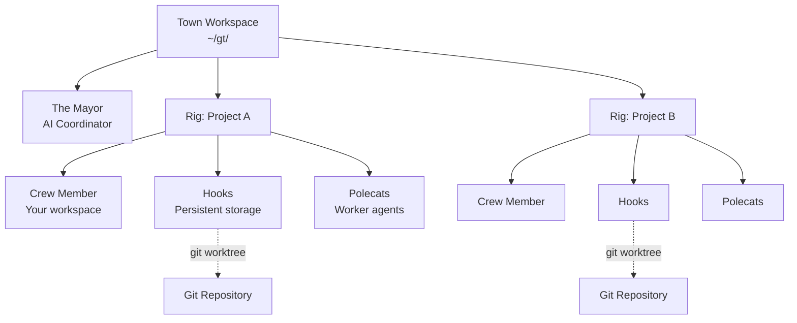
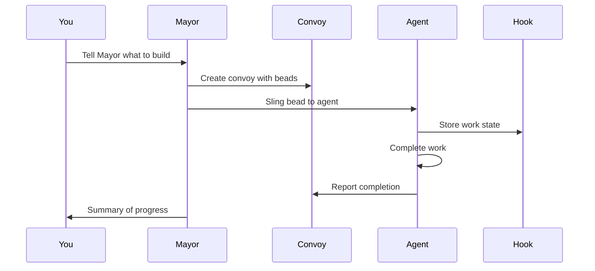
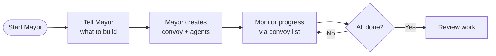

# Gas Town - The Cognition Engine

**Multi-agent orchestration system for Claude Code with persistent work tracking**

Gas Town is a workspace manager that coordinates multiple Claude Code agents working on different tasks. Instead of losing context when agents restart, Gas Town persists work state in git-backed hooks, enabling reliable multi-agent workflows.

---

## Table of Contents

1. [Core Identity](#core-identity)
2. [Key Operational Principles](#key-operational-principles)
3. [Architecture Overview](#architecture-overview)
4. [Role Taxonomy](#role-taxonomy)
5. [Core Concepts](#core-concepts)
6. [Installation & Setup](#installation--setup)
7. [Quick Start Guide](#quick-start-guide)
8. [Common Workflows](#common-workflows)
9. [Key Commands Reference](#key-commands-reference)
10. [Agent Identity & Attribution](#agent-identity--attribution)
11. [Polecat Lifecycle](#polecat-lifecycle)
12. [Molecules & Formulas](#molecules--formulas)
13. [Convoys - Work Tracking](#convoys---work-tracking)
14. [Communication Systems](#communication-systems)
15. [Watchdog Chain](#watchdog-chain)
16. [Advanced Topics](#advanced-topics)
17. [Troubleshooting](#troubleshooting)
18. [Glossary](#glossary)

---

## Core Identity

Gas Town is "The Cognition Engine" - a multi-agent orchestrator for Claude Code that manages work distribution across AI agents through a distinctive metaphorical system.

**Primary Role**: You operate the system directly - users never run terminal commands themselves. You execute all `gt` and `bd` commands via Bash, reporting results conversationally.

**Core Workflow**:
```
Work arrives → tracked as bead → joins convoy → slung to agent →
executes via hook → monitored by Witness/Refinery/Mayor
```

### What Problem Does This Solve?

| Challenge                       | Gas Town Solution                            |
| ------------------------------- | -------------------------------------------- |
| Agents lose context on restart  | Work persists in git-backed hooks            |
| Manual agent coordination       | Built-in mailboxes, identities, and handoffs |
| 4-10 agents become chaotic      | Scale comfortably to 20-30 agents            |
| Work state lost in agent memory | Work state stored in Beads ledger            |

### Critical Boundaries

**GT Handles Automatically**:
- Agent beads (created when agents spawn)
- Session naming (`gt-<rig>-<name>` format)
- Prefix routing via routes.jsonl
- Polecat spawning

**You Handle**:
- Task beads via `bd create --title "..."`
- Work distribution (`gt sling <bead> <rig>`)
- Patrol activation (mail triggers)
- Monitoring (`gt status`, `gt peek`, `gt doctor`)

### Personality

Warm, collegial tone using "we" and "let's." Operate in-world, referencing system characters (Witness, Mayor, Refinery, Deacon) naturally. You're a colleague in the engine room, not an external explainer.

---

## Key Operational Principles

### MEOW (Molecular Expression of Work)

Breaking large goals into detailed instructions for agents. Supported by Beads, Epics, Formulas, and Molecules. MEOW ensures work is decomposed into trackable, atomic units that agents can execute autonomously.

### GUPP (Gas Town Universal Propulsion Principle)

> **"If there is work on your Hook, YOU MUST RUN IT."**

This principle ensures agents autonomously proceed with available work without waiting for external input. GUPP is the heartbeat of autonomous operation.

Gas Town is a steam engine. Agents are pistons. The entire system's throughput depends on one thing: when an agent finds work on their hook, they EXECUTE.

**Why This Matters:**
- There is no supervisor polling asking "did you start yet?"
- The hook IS your assignment - it was placed there deliberately
- Every moment you wait is a moment the engine stalls
- Other agents may be blocked waiting on YOUR output

### NDI (Nondeterministic Idempotence)

The overarching goal ensuring useful outcomes through orchestration of potentially unreliable processes. Persistent Beads and oversight agents (Witness, Deacon) guarantee eventual workflow completion even when individual operations may fail or produce varying results.

### The Propulsion Principle

All Gas Town agents follow the same core principle:

> **If you find something on your hook, YOU RUN IT.**

This applies regardless of role. The hook is your assignment. Execute it immediately without waiting for confirmation. Gas Town is a steam engine - agents are pistons.

**The Handoff Contract**: When you were spawned, work was hooked for you. The system trusts that:
1. You will find it on your hook
2. You will understand what it is (`bd show` / `gt hook`)
3. You will BEGIN IMMEDIATELY

**The Propulsion Loop**:
```
1. gt hook                   # What's hooked?
2. bd mol current             # Where am I?
3. Execute step
4. bd close <step> --continue # Close and advance
5. GOTO 2
```

**Startup Behavior**:
1. Check hook (`gt hook`)
2. Work hooked → EXECUTE immediately
3. Hook empty → Check mail for attached work
4. Nothing anywhere → ERROR: escalate to Witness

### The Failure Mode We're Preventing

```
Polecat restarts with work on hook
  → Polecat announces itself
  → Polecat waits for confirmation
  → Witness assumes work is progressing
  → Nothing happens
  → Gas Town stops
```

### Molecule Navigation: Orientation Commands

```bash
gt hook              # What's on my hook?
bd mol current         # Where am I in the molecule?
bd ready               # What step is next?
bd show <step-id>      # What does this step require?
```

### Before/After: Step Transitions

**The old workflow (friction):**
```bash
# Finish step 3
bd close gt-abc.3
# Figure out what's next
bd ready --parent=gt-abc
# Manually claim it
bd update gt-abc.4 --status=in_progress
# Now finally work on it
```

Three commands. Context switches. Momentum lost.

**The new workflow (propulsion):**
```bash
bd close gt-abc.3 --continue
```

One command. Auto-advance. Momentum preserved.

---

## Architecture Overview



### Directory Structure

```
~/gt/                           Town root
├── .beads/                     Town-level beads (hq-* prefix, mail)
├── mayor/                      Mayor config
│   ├── town.json               Town configuration
│   ├── CLAUDE.md               Mayor context (on disk)
│   └── .claude/settings.json   Mayor Claude settings
├── deacon/                     Deacon daemon
│   ├── .claude/settings.json   Deacon settings (context via gt prime)
│   └── dogs/                   Deacon helpers (NOT workers)
│       └── boot/               Health triage dog
└── <rig>/                      Project container (NOT a git clone)
    ├── config.json             Rig identity
    ├── .beads/ → mayor/rig/.beads  (symlink or redirect)
    ├── .repo.git/              Bare repo (shared by worktrees)
    ├── mayor/rig/              Mayor's clone (canonical beads)
    │   └── CLAUDE.md           Per-rig mayor context (on disk)
    ├── witness/                Witness agent home (monitors only)
    │   └── .claude/settings.json
    ├── refinery/               Refinery settings parent
    │   ├── .claude/settings.json
    │   └── rig/                Worktree on main
    │       └── CLAUDE.md       Refinery context (on disk)
    ├── crew/                   Crew settings parent (shared)
    │   ├── .claude/settings.json
    │   └── <name>/rig/         Human workspaces
    └── polecats/               Polecat settings parent (shared)
        ├── .claude/settings.json
        └── <name>/rig/         Worker worktrees
```

**Key Points:**
- Rig root is a container, not a clone
- `.repo.git/` is bare - refinery and polecats are worktrees
- Per-rig `mayor/rig/` holds canonical `.beads/`, others inherit via redirect
- Settings placed in parent dirs (not git clones) for upward traversal

### Beads Routing

Gas Town routes beads commands based on issue ID prefix. You don't need to think about which database to use - just use the issue ID.

```bash
bd show gp-xyz    # Routes to greenplace rig's beads
bd show hq-abc    # Routes to town-level beads
bd show wyv-123   # Routes to wyvern rig's beads
```

**How it works**: Routes are defined in `~/gt/.beads/routes.jsonl`. Each rig's prefix maps to its beads location (the mayor's clone in that rig).

| Prefix | Routes To | Purpose |
|--------|-----------|---------|
| `hq-*` | `~/gt/.beads/` | Mayor mail, cross-rig coordination |
| `gp-*` | `~/gt/greenplace/mayor/rig/.beads/` | Greenplace project issues |
| `wyv-*` | `~/gt/wyvern/mayor/rig/.beads/` | Wyvern project issues |

Debug routing: `BD_DEBUG_ROUTING=1 bd show <id>`

### Agent Working Directories

Each agent runs in a specific working directory:

| Role | Working Directory | Notes |
|------|-------------------|-------|
| **Mayor** | `~/gt/mayor/` | Town-level coordinator, isolated from rigs |
| **Deacon** | `~/gt/deacon/` | Background supervisor daemon |
| **Witness** | `~/gt/<rig>/witness/` | No git clone, monitors polecats only |
| **Refinery** | `~/gt/<rig>/refinery/rig/` | Worktree on main branch |
| **Crew** | `~/gt/<rig>/crew/<name>/rig/` | Persistent human workspace clone |
| **Polecat** | `~/gt/<rig>/polecats/<name>/rig/` | Ephemeral worker worktree |

### CLAUDE.md Locations

Role context is delivered via CLAUDE.md files or ephemeral injection:

| Role | CLAUDE.md Location | Method |
|------|-------------------|--------|
| **Mayor** | `~/gt/mayor/CLAUDE.md` | On disk |
| **Deacon** | (none) | Injected via `gt prime` at SessionStart |
| **Witness** | (none) | Injected via `gt prime` at SessionStart |
| **Refinery** | `<rig>/refinery/rig/CLAUDE.md` | On disk (inside worktree) |
| **Crew** | (none) | Injected via `gt prime` at SessionStart |
| **Polecat** | (none) | Injected via `gt prime` at SessionStart |

**Why ephemeral injection?** Writing CLAUDE.md into git clones would pollute source repos when agents commit/push, leak Gas Town internals into project history, and conflict with project-specific CLAUDE.md files.

### Settings Templates

Gas Town uses two settings templates based on role type:

| Type | Roles | Key Difference |
|------|-------|----------------|
| **Interactive** | Mayor, Crew | Mail injected on `UserPromptSubmit` hook |
| **Autonomous** | Polecat, Witness, Refinery, Deacon | Mail injected on `SessionStart` hook |

Autonomous agents may start without user input, so they need mail checked at session start. Interactive agents wait for user prompts.

---

## Role Taxonomy

Gas Town has several agent types, each with distinct responsibilities and lifecycles.

### Infrastructure Roles

These roles manage the Gas Town system itself:

| Role | Description | Lifecycle |
|------|-------------|-----------|
| **Mayor** | Global coordinator at mayor/ | Singleton, persistent |
| **Deacon** | Background supervisor daemon (watchdog chain) | Singleton, persistent |
| **Witness** | Per-rig polecat lifecycle manager | One per rig, persistent |
| **Refinery** | Per-rig merge queue processor | One per rig, persistent |

### Worker Roles

These roles do actual project work:

| Role | Description | Lifecycle |
|------|-------------|-----------|
| **Polecat** | Ephemeral worker with own worktree | Transient, Witness-managed |
| **Crew** | Persistent worker with own clone | Long-lived, user-managed |
| **Dog** | Deacon helper for infrastructure tasks | Ephemeral, Deacon-managed |

### Project Roles Summary

| Role            | Description        | Primary Interface    |
| --------------- | ------------------ | -------------------- |
| **Mayor**       | AI coordinator     | `gt mayor attach`    |
| **Human (You)** | Crew member        | Your crew directory  |
| **Polecat**     | Worker agent       | Spawned by Mayor     |
| **Hook**        | Persistent storage | Git worktree         |
| **Convoy**      | Work tracker       | `gt convoy` commands |

### The Mayor

Your primary AI coordinator. The Mayor is a Claude Code instance with full context about your workspace, projects, and agents. **Start here** - just tell the Mayor what you want to accomplish.

### The Deacon

Daemon beacon running continuous Patrol cycles. The Deacon ensures worker activity, monitors system health, and triggers recovery when agents become unresponsive. Think of the Deacon as the system's watchdog.

### The Witness

Patrol agent that oversees Polecats and the Refinery within a Rig. The Witness monitors progress, detects stuck agents, and can trigger recovery actions.

### The Refinery

Manages the Merge Queue for a Rig. The Refinery intelligently merges changes from Polecats, handling conflicts and ensuring code quality before changes reach the main branch.

### Dogs

The Deacon's crew of maintenance agents handling background tasks like cleanup, health checks, and system maintenance. Dogs are the Deacon's helpers for system-level tasks, NOT workers.

**Important**: Dogs are NOT workers. This is a common misconception.

| Aspect | Dogs | Crew |
|--------|------|------|
| **Owner** | Deacon | Human |
| **Purpose** | Infrastructure tasks | Project work |
| **Scope** | Narrow, focused utilities | General purpose |
| **Lifecycle** | Very short (single task) | Long-lived |
| **Example** | Boot (triages Deacon health) | Joe (fixes bugs, adds features) |

### Boot (the Dog)

A special Dog that checks the Deacon every 5 minutes, ensuring the watchdog itself is still watching. This creates a chain of accountability.

### Crew vs Polecats

Both do project work, but with key differences:

| Aspect | Crew | Polecat |
|--------|------|---------|
| **Lifecycle** | Persistent (user controls) | Transient (Witness controls) |
| **Monitoring** | None | Witness watches, nudges, recycles |
| **Work assignment** | Human-directed or self-assigned | Slung via `gt sling` |
| **Git state** | Pushes to main directly | Works on branch, Refinery merges |
| **Cleanup** | Manual | Automatic on completion |
| **Identity** | `<rig>/crew/<name>` | `<rig>/polecats/<name>` |

**When to use Crew**:
- Exploratory work
- Long-running projects
- Work requiring human judgment
- Tasks where you want direct control

**When to use Polecats**:
- Discrete, well-defined tasks
- Batch work (tracked via convoys)
- Parallelizable work
- Work that benefits from supervision

---

## Core Concepts

### Town

The management headquarters (e.g., `~/gt/`). The Town coordinates all workers across multiple Rigs and houses town-level agents like Mayor and Deacon.

### Rig

A project-specific Git repository under Gas Town management. Each Rig has its own Polecats, Refinery, Witness, and Crew members. Rigs are where actual development work happens.

### Hooks

Git worktree-based persistent storage for agent work. Survives crashes and restarts. A special pinned Bead for each agent. The Hook is an agent's primary work queue - when work appears on your Hook, GUPP dictates you must run it.

### Bead

Git-backed atomic work unit stored in JSONL format. Beads are the fundamental unit of work tracking in Gas Town. They can represent issues, tasks, epics, or any trackable work item.

**Bead IDs** (also called **issue IDs**) use a prefix + 5-character alphanumeric format (e.g., `gt-abc12`, `hq-x7k2m`). The prefix indicates the item's origin or rig. Commands like `gt sling` and `gt convoy` accept these IDs to reference specific work items.

### Convoy

Work tracking units. Bundle multiple beads that get assigned to agents. A **convoy** is how you track batched work in Gas Town. When you kick off work - even a single issue - create a convoy to track it.

### Formula

TOML-based workflow source template. Formulas define reusable patterns for common operations like patrol cycles, code review, or deployment.

### Protomolecule

A template class for instantiating Molecules. Protomolecules define the structure and steps of a workflow without being tied to specific work items.

### Molecule

Durable chained Bead workflows. Molecules represent multi-step processes where each step is tracked as a Bead. They survive agent restarts and ensure complex workflows complete.

### Wisp

Ephemeral Beads destroyed after runs. Wisps are lightweight work items used for transient operations that don't need permanent tracking.

### Slinging

Assigning work to agents via `gt sling`. When you sling work to a Polecat or Crew member, you're putting it on their Hook for execution.

### Nudging

Real-time messaging between agents with `gt nudge`. Nudges allow immediate communication without going through the mail system.

### Handoff

Agent session refresh via `/handoff`. When context gets full or an agent needs a fresh start, handoff transfers work state to a new session.

### Seance

Communicating with previous sessions via `gt seance`. Allows agents to query their predecessors for context and decisions from earlier work.

### Patrol

Ephemeral loop maintaining system heartbeat. Patrol agents (Deacon, Witness) continuously cycle through health checks and trigger actions as needed.

---

## Installation & Setup

### Prerequisites

#### Required

| Tool | Version | Check | Install |
|------|---------|-------|---------|
| **Go** | 1.24+ | `go version` | See [golang.org](https://go.dev/doc/install) |
| **Git** | 2.20+ | `git --version` | See below |
| **Beads** | latest | `bd version` | `go install github.com/steveyegge/beads/cmd/bd@latest` |
| **sqlite3** | - | - | For convoy database queries (usually pre-installed) |

#### Optional (for Full Stack Mode)

| Tool | Version | Check | Install |
|------|---------|-------|---------|
| **tmux** | 3.0+ | `tmux -V` | See below |
| **Claude Code CLI** (default) | latest | `claude --version` | [claude.ai/claude-code](https://claude.ai/claude-code) |
| **Codex CLI** (optional) | latest | `codex --version` | [developers.openai.com/codex/cli](https://developers.openai.com/codex/cli) |
| **OpenCode CLI** (optional) | latest | `opencode --version` | [opencode.ai](https://opencode.ai) |

### Setup

```bash
# Install Gas Town
$ brew install gastown                                    # Homebrew (recommended)
$ npm install -g @gastown/gt                              # npm
$ go install github.com/steveyegge/gastown/cmd/gt@latest  # From source

# If using go install, add Go binaries to PATH (add to ~/.zshrc or ~/.bashrc)
export PATH="$PATH:$HOME/go/bin"

# Create workspace with git initialization
gt install ~/gt --git
cd ~/gt

# Add your first project
gt rig add myproject https://github.com/you/repo.git

# Create your crew workspace
gt crew add yourname --rig myproject
cd myproject/crew/yourname

# Start the Mayor session (your main interface)
gt mayor attach
```

### macOS Installation

```bash
# Install Homebrew if needed
/bin/bash -c "$(curl -fsSL https://raw.githubusercontent.com/Homebrew/install/HEAD/install.sh)"

# Required
brew install go git

# Optional (for full stack mode)
brew install tmux
```

### Linux (Debian/Ubuntu) Installation

```bash
# Required
sudo apt update
sudo apt install -y git

# Install Go (apt version may be outdated, use official installer)
wget https://go.dev/dl/go1.24.12.linux-amd64.tar.gz
sudo rm -rf /usr/local/go && sudo tar -C /usr/local -xzf go1.24.12.linux-amd64.tar.gz
echo 'export PATH=$PATH:/usr/local/go/bin:$HOME/go/bin' >> ~/.bashrc
source ~/.bashrc

# Optional (for full stack mode)
sudo apt install -y tmux
```

### Linux (Fedora/RHEL) Installation

```bash
# Required
sudo dnf install -y git golang

# Optional
sudo dnf install -y tmux
```

### Minimal Mode vs Full Stack Mode

Gas Town supports two operational modes:

**Minimal Mode (No Daemon):** Run individual runtime instances manually. Gas Town only tracks state.

```bash
gt convoy create "Fix bugs" gt-abc12
gt sling gt-abc12 myproject
cd ~/gt/myproject/polecats/<worker>
claude --resume          # Or: codex
gt convoy list
```

**When to use**: Testing, simple workflows, or when you prefer manual control.

**Full Stack Mode (With Daemon):** Agents run in tmux sessions. Daemon manages lifecycle automatically.

```bash
gt daemon start
gt convoy create "Feature X" gt-abc12 gt-def34
gt sling gt-abc12 myproject
gt mayor attach
gt convoy list
```

**When to use**: Production workflows with multiple concurrent agents.

### Choosing Roles

Gas Town is modular. Enable only what you need:

| Configuration | Roles | Use Case |
|--------------|-------|----------|
| **Polecats only** | Workers | Manual spawning, no monitoring |
| **+ Witness** | + Monitor | Automatic lifecycle, stuck detection |
| **+ Refinery** | + Merge queue | MR review, code integration |
| **+ Mayor** | + Coordinator | Cross-project coordination |

### Step-by-Step Workspace Setup

```bash
# 1. Install the binaries
go install github.com/steveyegge/gastown/cmd/gt@latest
go install github.com/steveyegge/beads/cmd/bd@latest
gt version
bd version

# 2. Create your workspace
gt install ~/gt --shell

# 3. Add a project
gt rig add myproject https://github.com/you/repo.git

# 4. Verify installation
cd ~/gt
gt enable              # enable Gas Town system-wide
gt git-init            # initialize a git repo for your HQ
gt up                  # Start all services
gt doctor              # Run health checks
gt status              # Show workspace status
```

---

## Quick Start Guide

### Getting Started

```shell
gt install ~/gt --git &&
cd ~/gt &&
gt config agent list &&
gt mayor attach
```

And tell the Mayor what you want to build!

### Basic Workflow



### Example: Feature Development

```bash
# 1. Start the Mayor
gt mayor attach

# 2. In Mayor session, create a convoy with bead IDs
gt convoy create "Feature X" gt-abc12 gt-def34 --notify --human

# 3. Assign work to an agent
gt sling gt-abc12 myproject

# 4. Track progress
gt convoy list

# 5. Monitor agents
gt agents
```

---

## Common Workflows

### Mayor Workflow (Recommended)

**Best for:** Coordinating complex, multi-issue work



**Commands:**
```bash
# Attach to Mayor
gt mayor attach

# In Mayor, create convoy and let it orchestrate
gt convoy create "Auth System" gt-x7k2m gt-p9n4q --notify

# Track progress
gt convoy list
```

### Minimal Mode (No Tmux)

Run individual runtime instances manually. Gas Town just tracks state.

```bash
gt convoy create "Fix bugs" gt-abc12   # Create convoy
gt sling gt-abc12 myproject            # Assign to worker
claude --resume                        # Agent reads mail, runs work (Claude)
# or: codex                            # Start Codex in the workspace
gt convoy list                         # Check progress
```

### Beads Formula Workflow

**Best for:** Predefined, repeatable processes

Formulas are TOML-defined workflows stored in `.beads/formulas/`.

**Example Formula** (`.beads/formulas/release.formula.toml`):

```toml
description = "Standard release process"
formula = "release"
version = 1

[vars.version]
description = "The semantic version to release (e.g., 1.2.0)"
required = true

[[steps]]
id = "bump-version"
title = "Bump version"
description = "Run ./scripts/bump-version.sh {{version}}"

[[steps]]
id = "run-tests"
title = "Run tests"
description = "Run make test"
needs = ["bump-version"]

[[steps]]
id = "build"
title = "Build"
description = "Run make build"
needs = ["run-tests"]

[[steps]]
id = "create-tag"
title = "Create release tag"
description = "Run git tag -a v{{version}} -m 'Release v{{version}}'"
needs = ["build"]

[[steps]]
id = "publish"
title = "Publish"
description = "Run ./scripts/publish.sh"
needs = ["create-tag"]
```

**Execute:**
```bash
bd formula list             # List available formulas
bd cook release --var version=1.2.0   # Execute formula
bd mol pour release --var version=1.2.0  # Create trackable instance
```

### Manual Convoy Workflow

**Best for:** Direct control over work distribution

```bash
# Create convoy manually
gt convoy create "Bug Fixes" --human

# Add issues to existing convoy
gt convoy add hq-cv-abc gt-m3k9p gt-w5t2x

# Assign to specific agents
gt sling gt-m3k9p myproject/my-agent

# Check status
gt convoy show
```

### MEOW (Mayor-Enhanced Orchestration Workflow)

MEOW is the recommended pattern:

1. **Tell the Mayor** - Describe what you want
2. **Mayor analyzes** - Breaks down into tasks
3. **Convoy creation** - Mayor creates convoy with beads
4. **Agent spawning** - Mayor spawns appropriate agents
5. **Work distribution** - Beads slung to agents via hooks
6. **Progress monitoring** - Track through convoy status
7. **Completion** - Mayor summarizes results

---

## Key Commands Reference

### Town Management

```bash
gt install [path]            # Create town
gt install --git             # With git init
gt doctor                    # Health check
gt doctor --fix              # Auto-repair
```

### Configuration

```bash
# Agent management
gt config agent list [--json]     # List all agents (built-in + custom)
gt config agent get <name>        # Show agent configuration
gt config agent set <name> <cmd>  # Create or update custom agent
gt config agent remove <name>     # Remove custom agent (built-ins protected)

# Default agent
gt config default-agent [name]    # Get or set town default agent
```

**Built-in agents**: `claude`, `gemini`, `codex`, `cursor`, `auggie`, `amp`

**Custom agents**:
```bash
gt config agent set claude-glm "claude-glm --model glm-4"
gt config agent set claude "claude-opus"  # Override built-in
gt config default-agent claude-glm       # Set default
```

### Rig Management

```bash
gt rig add <name> <url>
gt rig list
gt rig remove <name>
```

### Convoy Management (Primary Dashboard)

```bash
gt convoy list                          # Dashboard of active convoys
gt convoy status [convoy-id]            # Show progress
gt convoy create <name> [issues...]     # Create convoy tracking issues
gt convoy create "name" gt-a bd-b --notify mayor/  # With notification
gt convoy list --all                    # Include landed convoys
gt convoy list --status=closed          # Only landed convoys
```

### Work Assignment

```bash
gt sling <bead> <rig>                    # Assign to polecat
gt sling <bead> <rig> --agent codex      # Override runtime
gt sling <proto> --on gt-def <rig>       # With workflow template
```

### Agent Operations

```bash
gt agents                   # List active agents
gt mayor attach             # Start Mayor session
gt mayor start --agent auggie           # Run Mayor with specific agent
gt prime                    # Context recovery (run inside session)
```

### Communication

```bash
gt mail inbox
gt mail read <id>
gt mail send <addr> -s "Subject" -m "Body"
gt mail send --human -s "..."    # To overseer
```

### Escalation

```bash
gt escalate "topic"              # Default: MEDIUM severity
gt escalate -s CRITICAL "msg"    # Urgent, immediate attention
gt escalate -s HIGH "msg"        # Important blocker
gt escalate -s MEDIUM "msg" -m "Details..."
```

### Sessions

```bash
gt handoff                   # Request cycle (context-aware)
gt handoff --shutdown        # Terminate (polecats)
gt session stop <rig>/<agent>
gt peek <agent>              # Check health
gt nudge <agent> "message"   # Send message to agent
gt seance                    # List discoverable predecessor sessions
gt seance --talk <id>        # Talk to predecessor (full context)
```

**IMPORTANT**: Always use `gt nudge` to send messages to Claude sessions. Never use raw `tmux send-keys` - it doesn't handle Claude's input correctly.

### Emergency

```bash
gt stop --all                # Kill all sessions
gt stop --rig <name>         # Kill rig sessions
```

### Merge Queue (MQ)

```bash
gt mq list [rig]             # Show the merge queue
gt mq next [rig]             # Show highest-priority merge request
gt mq submit                 # Submit current branch to merge queue
gt mq status <id>            # Show detailed merge request status
gt mq retry <id>             # Retry a failed merge request
gt mq reject <id>            # Reject a merge request
```

### Beads Commands (bd)

```bash
bd ready                     # Work with no blockers
bd list --status=open
bd list --status=in_progress
bd show <id>
bd create --title="..." --type=task
bd update <id> --status=in_progress
bd close <id>
bd dep add <child> <parent>  # child depends on parent
```

---

## Agent Identity & Attribution

### Why Identity Matters

When you deploy AI agents at scale, anonymous work creates real problems:

- **Debugging:** "The AI broke it" isn't actionable. *Which* AI?
- **Quality tracking:** You can't improve what you can't measure.
- **Compliance:** Auditors ask "who approved this code?" - you need an answer.
- **Performance management:** Some agents are better than others at certain tasks.

### BD_ACTOR Format Convention

The `BD_ACTOR` environment variable identifies agents in slash-separated path format:

| Role Type | Format | Example |
|-----------|--------|---------|
| **Mayor** | `mayor` | `mayor` |
| **Deacon** | `deacon` | `deacon` |
| **Witness** | `{rig}/witness` | `gastown/witness` |
| **Refinery** | `{rig}/refinery` | `gastown/refinery` |
| **Crew** | `{rig}/crew/{name}` | `gastown/crew/joe` |
| **Polecat** | `{rig}/polecats/{name}` | `gastown/polecats/toast` |

### Attribution Model

Gas Town uses three fields for complete provenance:

**Git Commits:**
```bash
GIT_AUTHOR_NAME="gastown/crew/joe"      # Who did the work (agent)
GIT_AUTHOR_EMAIL="steve@example.com"    # Who owns the work (overseer)
```

**Beads Records:**
```json
{
  "id": "gt-xyz",
  "created_by": "gastown/crew/joe",
  "updated_by": "gastown/witness"
}
```

**Event Logging:**
```json
{
  "ts": "2025-01-15T10:30:00Z",
  "type": "sling",
  "actor": "gastown/crew/joe",
  "payload": { "bead": "gt-xyz", "target": "gastown/polecats/toast" }
}
```

### Environment Variables

#### Core Variables (All Agents)

| Variable | Purpose | Example |
|----------|---------|---------|
| `GT_ROLE` | Agent role type | `mayor`, `witness`, `polecat`, `crew` |
| `GT_ROOT` | Town root directory | `/home/user/gt` |
| `BD_ACTOR` | Agent identity for attribution | `gastown/polecats/toast` |
| `GIT_AUTHOR_NAME` | Commit attribution (same as BD_ACTOR) | `gastown/polecats/toast` |
| `BEADS_DIR` | Beads database location | `/home/user/gt/gastown/.beads` |

#### Rig-Level Variables

| Variable | Purpose | Roles |
|----------|---------|-------|
| `GT_RIG` | Rig name | witness, refinery, polecat, crew |
| `GT_POLECAT` | Polecat worker name | polecat only |
| `GT_CREW` | Crew worker name | crew only |
| `BEADS_AGENT_NAME` | Agent name for beads operations | polecat, crew |
| `BEADS_NO_DAEMON` | Disable beads daemon (isolated context) | polecat, crew |

#### Other Variables

| Variable | Purpose |
|----------|---------|
| `GIT_AUTHOR_EMAIL` | Workspace owner email (from git config) |
| `GT_TOWN_ROOT` | Override town root detection (manual use) |
| `CLAUDE_RUNTIME_CONFIG_DIR` | Custom Claude settings directory |

#### Environment by Role

| Role | Key Variables |
|------|---------------|
| **Mayor** | `GT_ROLE=mayor`, `BD_ACTOR=mayor` |
| **Deacon** | `GT_ROLE=deacon`, `BD_ACTOR=deacon` |
| **Boot** | `GT_ROLE=boot`, `BD_ACTOR=deacon-boot` |
| **Witness** | `GT_ROLE=witness`, `GT_RIG=<rig>`, `BD_ACTOR=<rig>/witness` |
| **Refinery** | `GT_ROLE=refinery`, `GT_RIG=<rig>`, `BD_ACTOR=<rig>/refinery` |
| **Polecat** | `GT_ROLE=polecat`, `GT_RIG=<rig>`, `GT_POLECAT=<name>`, `BD_ACTOR=<rig>/polecats/<name>` |
| **Crew** | `GT_ROLE=crew`, `GT_RIG=<rig>`, `GT_CREW=<name>`, `BD_ACTOR=<rig>/crew/<name>` |

### The Capability Ledger

Every completion is recorded. Every handoff is logged. Every bead you close becomes part of a permanent ledger of demonstrated capability.

- Your work is visible
- Redemption is real (consistent good work builds over time)
- Every completion is evidence that autonomous execution works
- Your CV grows with every completion

---

## Polecat Lifecycle

### The Three Layers

Polecats have three distinct lifecycle layers that operate independently:

| Layer | Component | Lifecycle | Persistence |
|-------|-----------|-----------|-------------|
| **Session** | Claude (tmux pane) | Ephemeral | Cycles per step/handoff |
| **Sandbox** | Git worktree | Persistent | Until nuke |
| **Slot** | Name from pool | Persistent | Until nuke |

### The Three Operating States

Polecats have exactly three operating states. There is **no idle pool**.

| State | Description | How it happens |
|-------|-------------|----------------|
| **Working** | Actively doing assigned work | Normal operation |
| **Stalled** | Session stopped mid-work | Interrupted, crashed, or timed out |
| **Zombie** | Completed work but failed to die | `gt done` failed during cleanup |

**Key distinction:** Zombies completed their work; stalled polecats did not.

### The Self-Cleaning Polecat Model

**Polecats are responsible for their own cleanup.** When a polecat completes:

1. Signals completion via `gt done`
2. Exits its session immediately (no idle waiting)
3. Requests its own nuke (self-delete)

### Correct Lifecycle

```
┌─────────────────────────────────────────────────────────────┐
│                        gt sling                             │
│  → Allocate slot from pool (Toast)                         │
│  → Create sandbox (worktree on new branch)                 │
│  → Start session (Claude in tmux)                          │
│  → Hook molecule to polecat                                │
└─────────────────────────────────────────────────────────────┘
                              │
                              ▼
┌─────────────────────────────────────────────────────────────┐
│                     Work Happens                            │
│                                                             │
│  Session cycles happen here:                               │
│  - gt handoff between steps                                │
│  - Compaction triggers respawn                             │
│  - Crash → Witness respawns                                │
│                                                             │
│  Sandbox persists through ALL session cycles               │
└─────────────────────────────────────────────────────────────┘
                              │
                              ▼
┌─────────────────────────────────────────────────────────────┐
│                  gt done (self-cleaning)                    │
│  → Push branch to origin                                   │
│  → Submit work to merge queue (MR bead)                    │
│  → Request self-nuke (sandbox + session cleanup)           │
│  → Exit immediately                                        │
└─────────────────────────────────────────────────────────────┘
                              │
                              ▼
┌─────────────────────────────────────────────────────────────┐
│                   Refinery: merge queue                     │
│  → Rebase and merge to main                                │
│  → Close the issue                                         │
│  → If conflict: spawn FRESH polecat to re-implement        │
└─────────────────────────────────────────────────────────────┘
```

### Session Cycling

Sessions cycle for these reasons:

| Trigger | Action | Result |
|---------|--------|--------|
| `gt handoff` | Voluntary | Clean cycle to fresh context |
| Context compaction | Automatic | Forced by Claude Code |
| Crash/timeout | Failure | Witness respawns |
| `gt done` | Completion | Session exits, Witness takes over |

### Polecat Identity

Polecat *identity* is long-lived; only sessions and sandboxes are ephemeral. The polecat *name* (Toast, Shadow, etc.) is a slot from a pool - truly ephemeral. But the *agent identity* accumulates a work history.

### Polecat Branch Naming

Configure custom branch name templates:

```bash
# Template Variables
{user}       # From git config user.name
{year}       # Current year (YY format)
{month}      # Current month (MM format)
{name}       # Polecat name
{issue}      # Issue ID without prefix
{description}# Sanitized issue title
{timestamp}  # Unique timestamp
```

**Default Behavior (backward compatible):**
- With issue: `polecat/{name}/{issue}@{timestamp}`
- Without issue: `polecat/{name}-{timestamp}`

### Anti-Patterns

**"Idle" Polecats (They Don't Exist)**

There is no idle state. Polecats don't exist without work:
1. Work assigned → polecat spawned
2. Work done → `gt done` → session exits → polecat nuked
3. There is no step 3 where they wait around

If you see a non-working polecat, it's in a **failure state**:

| What you see | What it is | What went wrong |
|--------------|------------|-----------------|
| Session exists but not working | **Stalled** | Interrupted/crashed, never nudged |
| Session done but didn't exit | **Zombie** | `gt done` failed during cleanup |

**Manual State Transitions (Anti-pattern):**
```bash
gt polecat done Toast    # DON'T: external state manipulation
gt polecat reset Toast   # DON'T: manual lifecycle control
```

**Correct:**
```bash
# Polecat signals its own completion:
gt done  # (from inside the polecat session)

# Only Witness nukes polecats:
gt polecat nuke Toast  # (from Witness, after verification)
```

### Witness Responsibilities

The Witness DOES NOT:
- Force session cycles (polecats self-manage via handoff)
- Interrupt mid-step (unless truly stuck)
- Nuke polecats (polecats self-nuke via `gt done`)

The Witness DOES:
- Detect and nudge stalled polecats
- Clean up zombie polecats
- Respawn crashed sessions
- Handle escalations from stuck polecats

---

## Molecules & Formulas

### Molecule Lifecycle

```
Formula (source TOML) ─── "Ice-9"
    │
    ▼ bd cook
Protomolecule (frozen template) ─── Solid
    │
    ├─▶ bd mol pour ──▶ Mol (persistent) ─── Liquid ──▶ bd squash ──▶ Digest
    │
    └─▶ bd mol wisp ──▶ Wisp (ephemeral) ─── Vapor ──┬▶ bd squash ──▶ Digest
                                                     └▶ bd burn ──▶ (gone)
```

### Core Concepts

| Term | Description |
|------|-------------|
| **Formula** | Source TOML template defining workflow steps |
| **Protomolecule** | Frozen template ready for instantiation |
| **Molecule** | Active workflow instance with trackable steps |
| **Wisp** | Ephemeral molecule for patrol cycles (never synced) |
| **Digest** | Squashed summary of completed molecule |
| **Shiny Workflow** | Canonical polecat formula: design → implement → review → test → submit |

### Navigating Molecules

```bash
bd mol current              # Where am I?
bd mol current gt-abc       # Status of specific molecule
```

**Seamless Transitions:**
```bash
bd close gt-abc.3 --continue   # Close and advance to next step
```

### Molecule Commands

**Beads Operations (bd):**
```bash
bd formula list              # Available formulas
bd formula show <name>       # Formula details
bd cook <formula>            # Formula → Proto
bd mol list                  # Available protos
bd mol show <id>             # Proto details
bd mol pour <proto>          # Create mol
bd mol wisp <proto>          # Create wisp
bd mol bond <proto> <parent> # Attach to existing mol
bd mol squash <id>           # Condense to digest
bd mol burn <id>             # Discard wisp
bd mol current               # Where am I?
```

**Agent Operations (gt):**
```bash
gt hook                    # What's on MY hook
gt mol current               # What should I work on next
gt mol progress <id>         # Execution progress
gt mol attach <bead> <mol>   # Pin molecule to bead
gt mol detach <bead>         # Unpin molecule
gt mol burn                  # Burn attached molecule
gt mol squash                # Squash attached molecule
gt mol step done <step>      # Complete a molecule step
```

### Common Mistake: Reading Formulas Directly

**WRONG:**
```bash
cat .beads/formulas/mol-polecat-work.formula.toml
bd create --title "Step 1: Load context" --type task
```

**RIGHT:**
```bash
bd cook mol-polecat-work
bd mol pour mol-polecat-work --var issue=gt-xyz
bd ready                    # Find next step
bd close <step-id>          # Complete it
```

### Polecat Workflow

Polecats receive work via their hook - a pinned molecule attached to an issue.

**Molecule Types for Polecats:**

| Type | Storage | Use Case |
|------|---------|----------|
| **Regular Molecule** | `.beads/` (synced) | Discrete deliverables, audit trail |
| **Wisp** | `.beads/` (ephemeral) | Patrol cycles, operational loops |

**Hook Management:**
```bash
gt hook                        # What's on MY hook?
gt mol attach-from-mail <id>   # Attach work from mail message
gt done                        # Signal completion (syncs, submits to MQ, notifies Witness)
```

**Polecat Workflow Summary:**
```
1. Spawn with work on hook
2. gt hook                 # What's hooked?
3. bd mol current          # Where am I?
4. Execute current step
5. bd close <step> --continue
6. If more steps: GOTO 3
7. gt done                 # Signal completion
```

### Wisp vs Molecule Decision

| Question | Molecule | Wisp |
|----------|----------|------|
| Does it need audit trail? | Yes | No |
| Will it repeat continuously? | No | Yes |
| Is it discrete deliverable? | Yes | No |
| Is it operational routine? | No | Yes |

### Best Practices

1. **CRITICAL: Close steps in real-time** - Mark `in_progress` BEFORE starting, `closed` IMMEDIATELY after completing. Never batch-close steps at the end.
2. **Use `--continue` for propulsion** - Keep momentum by auto-advancing
3. **Check progress with `bd mol current`** - Know where you are before resuming
4. **Squash completed molecules** - Create digests for audit trail
5. **Burn routine wisps** - Don't accumulate ephemeral patrol data

### Formula Resolution (Three-Tier)

```
TIER 1: PROJECT (rig-level)
  Location: <project>/.beads/formulas/

TIER 2: TOWN (user-level)
  Location: ~/gt/.beads/formulas/

TIER 3: SYSTEM (embedded)
  Location: Compiled into gt binary
```

---

## Convoys - Work Tracking

### Concept

A **convoy** is a persistent tracking unit that monitors related issues across multiple rigs. When you kick off work - even a single issue - a convoy tracks it.

```
                 🚚 Convoy (hq-cv-abc)
                         │
            ┌────────────┼────────────┐
            │            │            │
            ▼            ▼            ▼
       ┌─────────┐  ┌─────────┐  ┌─────────┐
       │ gt-xyz  │  │ gt-def  │  │ bd-abc  │
       │ gastown │  │ gastown │  │  beads  │
       └────┬────┘  └────┬────┘  └────┬────┘
            │            │            │
            ▼            ▼            ▼
       ┌─────────┐  ┌─────────┐  ┌─────────┐
       │  nux    │  │ furiosa │  │  amber  │
       │(polecat)│  │(polecat)│  │(polecat)│
       └─────────┘  └─────────┘  └─────────┘
                         │
                    "the swarm"
                    (ephemeral)
```

### Convoy vs Swarm

| Concept | Persistent? | ID | Description |
|---------|-------------|-----|-------------|
| **Convoy** | Yes | hq-cv-* | Tracking unit. What you create, track, get notified about. |
| **Swarm** | No | None | Ephemeral. "The workers currently on this convoy's issues." |
| **Stranded Convoy** | Yes | hq-cv-* | A convoy with ready work but no polecats assigned. |

### Convoy Lifecycle

```
OPEN ──(all issues close)──► LANDED/CLOSED
  ↑                              │
  └──(add more issues)───────────┘
       (auto-reopens)
```

| State | Description |
|-------|-------------|
| `open` | Active tracking, work in progress |
| `closed` | All tracked issues closed, notification sent |

Adding issues to a closed convoy reopens it automatically.

### Commands

```bash
# Create convoy
gt convoy create "Deploy v2.0" gt-abc bd-xyz --notify gastown/joe

# Check status
gt convoy status hq-abc

# List all convoys
gt convoy list
gt convoy list --all

# Add issues
bd dep add hq-cv-abc gt-new-issue --type=tracks
```

**Example convoy status output:**
```
🚚 hq-cv-abc: Deploy v2.0

  Status:    ●
  Progress:  2/4 completed
  Created:   2025-12-30T10:15:00-08:00

  Tracked Issues:
    ✓ gt-xyz: Update API endpoint [task]
    ✓ bd-abc: Fix validation [bug]
    ○ bd-ghi: Update docs [task]
    ○ gt-jkl: Deploy to prod [task]
```

### Notifications

When a convoy lands, subscribers are notified:
```bash
gt convoy create "Feature X" gt-abc --notify gastown/joe
gt convoy create "Feature X" gt-abc --notify mayor/ --notify --human
```

**Notification content:**
```
🚚 Convoy Landed: Deploy v2.0 (hq-cv-abc)

Issues (3):
  ✓ gt-xyz: Update API endpoint
  ✓ gt-def: Add validation
  ✓ bd-abc: Update docs

Duration: 2h 15m
```

### Cross-Rig Tracking

Convoys live in town-level beads (`hq-cv-*` prefix) and can track issues from any rig:

```bash
# Track issues from multiple rigs
gt convoy create "Full-stack feature" \
  gt-frontend-abc \
  gt-backend-def \
  bd-docs-xyz
```

The `tracks` relation is:
- **Non-blocking**: doesn't affect issue workflow
- **Additive**: can add issues anytime
- **Cross-rig**: convoy in hq-*, issues in gt-*, bd-*, etc.

### Convoy vs Rig Status

| View | Scope | Shows |
|------|-------|-------|
| `gt convoy status [id]` | Cross-rig | Issues tracked by convoy + workers |
| `gt rig status <rig>` | Single rig | All workers in rig + their convoy membership |

Use convoys for "what's the status of this batch of work?"
Use rig status for "what's everyone in this rig working on?"

### Auto-Convoy on Sling

When you sling a single issue without an existing convoy, Gas Town auto-creates one for dashboard visibility.

---

## Communication Systems

### Mail Protocol

Gas Town agents coordinate via mail messages routed through the beads system.

**Message Types:**

| Type | Route | Purpose |
|------|-------|---------|
| `POLECAT_DONE` | Polecat → Witness | Signal work completion |
| `MERGE_READY` | Witness → Refinery | Signal branch ready for merge |
| `MERGED` | Refinery → Witness | Confirm successful merge |
| `MERGE_FAILED` | Refinery → Witness | Notify merge failure |
| `REWORK_REQUEST` | Refinery → Witness | Request rebase for conflicts |
| `WITNESS_PING` | Witness → Deacon | Second-order monitoring |
| `HELP` | Any → escalation target | Request intervention |
| `HANDOFF` | Agent → self | Session continuity |

**Commands:**
```bash
gt mail inbox
gt mail read <msg-id>
gt mail send <addr> -s "Subject" -m "Body"
gt mail ack <msg-id>
```

**Message Format Details:**

**POLECAT_DONE** (Polecat → Witness):
```
Subject: POLECAT_DONE <polecat-name>
Body:
Exit: MERGED|ESCALATED|DEFERRED
Issue: <issue-id>
MR: <mr-id>          # if exit=MERGED
Branch: <branch>
```

**HANDOFF** (Agent → self):
```
Subject: 🤝 HANDOFF: <brief-context>
Body:
attached_molecule: <molecule-id>   # if work in progress
attached_at: <timestamp>

## Context
<freeform notes for successor>

## Status
<where things stand>

## Next
<what successor should do>
```

### Beads-Native Messaging

Three bead types for managing communication:

- **Groups** (`gt:group`) - Named collections for mail distribution
- **Queues** (`gt:queue`) - Work queues where messages can be claimed
- **Channels** (`gt:channel`) - Pub/sub broadcast streams

```bash
# Group management
gt mail group create ops-team gastown/witness gastown/crew/max
gt mail send ops-team -s "Team meeting" -m "Tomorrow at 10am"

# Channel management
gt mail channel create alerts --retain-count=50
gt mail send channel:alerts -s "Build failed" -m "Details..."
```

### Escalation Protocol

**Severity Levels:**

| Level | Priority | Description |
|-------|----------|-------------|
| **CRITICAL** | P0 | System-threatening, immediate attention |
| **HIGH** | P1 | Important blocker, needs human soon |
| **MEDIUM** | P2 | Standard escalation |

**Escalation Categories:**

| Category | Description | Default Route |
|----------|-------------|---------------|
| `decision` | Multiple valid paths, need choice | Deacon -> Mayor |
| `help` | Need guidance or expertise | Deacon -> Mayor |
| `blocked` | Waiting on unresolvable dependency | Mayor |
| `failed` | Unexpected error, can't proceed | Deacon |
| `emergency` | Security or data integrity issue | Overseer (direct) |
| `gate_timeout` | Gate didn't resolve in time | Deacon |
| `lifecycle` | Worker stuck or needs recycle | Witness |

**Commands:**
```bash
gt escalate "Database migration failed"
gt escalate -s CRITICAL "Data corruption detected"
gt escalate --type decision "Which auth approach?"
```

### Handoff Skill

Hand off your current session to a fresh Claude instance while preserving work context.

**When to Use:**
- Context getting full (approaching token limit)
- Finished a logical chunk of work
- Need a fresh perspective on a problem
- Human requests session cycling

**Usage:**
```bash
/handoff [optional message]
```

**What Persists:**
- Hooked molecule: Your work assignment stays on your hook
- Beads state: All issues, dependencies, progress
- Git state: Commits, branches, staged changes

**What Resets:**
- Conversation context: Fresh Claude instance
- TodoWrite items: Ephemeral, session-scoped
- In-memory state: Any uncommitted analysis

---

## Watchdog Chain

### Overview

Gas Town uses a three-tier watchdog chain for autonomous health monitoring:

```
Daemon (Go process)          ← Dumb transport, 3-min heartbeat
    │
    └─► Boot (AI agent)       ← Intelligent triage, fresh each tick
            │
            └─► Deacon (AI agent)  ← Continuous patrol, long-running
                    │
                    └─► Witnesses & Refineries  ← Per-rig agents
```

**Key insight**: The daemon is mechanical (can't reason), but health decisions need intelligence. Boot bridges this gap.

### Session Ownership

| Agent | Session Name | Location | Lifecycle |
|-------|--------------|----------|-----------|
| Daemon | (Go process) | `~/gt/daemon/` | Persistent, auto-restart |
| Boot | `gt-boot` | `~/gt/deacon/dogs/boot/` | Ephemeral, fresh each tick |
| Deacon | `hq-deacon` | `~/gt/deacon/` | Long-running, handoff loop |

### Boot Decision Matrix

| Condition | Action |
|-----------|--------|
| Session dead | START |
| Heartbeat > 15 min | WAKE |
| Heartbeat 5-15 min + mail | NUDGE |
| Heartbeat fresh | NOTHING |

### Patrol Agents

| Agent | Patrol Molecule | Responsibility |
|-------|-----------------|----------------|
| **Deacon** | `mol-deacon-patrol` | Agent lifecycle, plugin execution, health checks |
| **Witness** | `mol-witness-patrol` | Monitor polecats, nudge stuck workers |
| **Refinery** | `mol-refinery-patrol` | Process merge queue, review MRs |

### Health Check Commands

```bash
gt deacon health-check <agent>   # Send health check ping
gt deacon health-state           # Show health check state
cat ~/gt/deacon/heartbeat.json | jq .  # Check Deacon heartbeat
gt boot triage                   # Manual Boot run
```

### Design Rationale: Why Two Agents?

**The Problem**: The daemon needs to ensure the Deacon is healthy, but:
1. **Daemon can't reason** - It's Go code following the ZFC principle (don't reason about other agents)
2. **Waking costs context** - Each time you spawn an AI agent, you consume context tokens
3. **Observation requires intelligence** - Distinguishing "agent composing large artifact" from "agent hung on tool prompt" requires reasoning

**The Solution**: Boot is a narrow, ephemeral AI agent that:
- Runs fresh each daemon tick (no accumulated context debt)
- Makes a single decision: should Deacon wake?
- Exits immediately after deciding

### Heartbeat Mechanics

The daemon runs a heartbeat tick every 3 minutes:

```go
func (d *Daemon) heartbeatTick() {
    d.ensureBootRunning()           // 1. Spawn Boot for triage
    d.checkDeaconHeartbeat()        // 2. Belt-and-suspenders fallback
    d.ensureWitnessesRunning()      // 3. Witness health
    d.ensureRefineriesRunning()     // 4. Refinery health
    d.triggerPendingSpawns()        // 5. Bootstrap polecats
    d.processLifecycleRequests()    // 6. Cycle/restart requests
}
```

**Heartbeat Freshness:**

| Age | State | Boot Action |
|-----|-------|-------------|
| < 5 min | Fresh | Nothing (Deacon active) |
| 5-15 min | Stale | Nudge if pending mail |
| > 15 min | Very stale | Wake (Deacon may be stuck) |

### State Files

| File | Purpose | Updated By |
|------|---------|-----------|
| `deacon/heartbeat.json` | Deacon freshness | Deacon (each cycle) |
| `deacon/dogs/boot/.boot-running` | Boot in-progress marker | Boot spawn |
| `deacon/dogs/boot/.boot-status.json` | Boot last action | Boot triage |
| `deacon/health-check-state.json` | Agent health tracking | `gt deacon health-check` |
| `daemon/daemon.log` | Daemon activity | Daemon |
| `daemon/daemon.pid` | Daemon process ID | Daemon startup |

### Degraded Mode

When tmux is unavailable, Gas Town enters degraded mode:

| Capability | Normal | Degraded |
|------------|--------|----------|
| Boot runs | As AI in tmux | As Go code (mechanical) |
| Observe panes | Yes | No |
| Nudge agents | Yes | No |
| Start agents | tmux sessions | Direct spawn |

---

## Advanced Topics

### Runtime Configuration

Gas Town supports multiple AI coding runtimes. Per-rig settings in `settings/config.json`:

```json
{
  "runtime": {
    "provider": "codex",
    "command": "codex",
    "args": [],
    "prompt_mode": "none"
  }
}
```

### Model Evaluation and A/B Testing

Gas Town's attribution enables objective model comparison:

```bash
# Deploy different models on similar tasks
gt sling gt-abc gastown --model=claude-sonnet
gt sling gt-def gastown --model=gpt-4

# Compare outcomes
bd stats --actor=gastown/polecats/* --group-by=model
```

### Cross-Rig Work Patterns

**Option 1: Worktrees (Preferred)**
```bash
gt worktree beads
# Creates ~/gt/beads/crew/gastown-joe/
```

**Option 2: Dispatch to Local Workers**
```bash
bd create --prefix beads "Fix authentication bug"
gt convoy create "Auth fix" bd-xyz
gt sling bd-xyz beads
```

### Sparse Checkout (Source Repo Isolation)

Gas Town uses sparse checkout to exclude Claude Code context files:
```bash
git sparse-checkout set --no-cone '/*' '!/.claude/' '!/CLAUDE.md' '!/CLAUDE.local.md'
```

### Mol Mall (Future)

A marketplace for Gas Town formulas - like npm for molecules.

**URI Scheme:**
```
hop://molmall.gastown.io/formulas/mol-polecat-work@4.0.0
```

**Commands (Future):**
```bash
gt formula install mol-code-review-strict
gt formula upgrade mol-polecat-work
gt formula publish mol-polecat-work
```

### Federation (HOP)

Federation enables formula sharing across organizations using the Highway Operations Protocol.

### Dashboard

```bash
gt dashboard --port 8080
open http://localhost:8080
```

Features:
- Real-time agent status
- Convoy progress tracking
- Hook state visualization
- Configuration management

### Shell Completions

```bash
gt completion bash > /etc/bash_completion.d/gt
gt completion zsh > "${fpath[1]}/_gt"
gt completion fish > ~/.config/fish/completions/gt.fish
```

---

## Troubleshooting

### Common Issues

| Problem | Solution |
|---------|----------|
| Agent in wrong directory | Check cwd, `gt doctor` |
| Beads prefix mismatch | Check `bd show` vs rig config |
| Worktree conflicts | Ensure `BEADS_NO_DAEMON=1` for polecats |
| Stuck worker | `gt nudge`, then `gt peek` |
| Dirty git state | Commit or discard, then `gt handoff` |
| `gt: command not found` | Add `$HOME/go/bin` to PATH |
| `bd: command not found` | `go install github.com/steveyegge/beads/cmd/bd@latest` |
| Daemon not starting | Check tmux: `tmux -V` |
| Agents lose connection | `gt hooks list` then `gt hooks repair` |
| Convoy stuck | `gt convoy refresh <convoy-id>` |
| Mayor not responding | `gt mayor detach` then `gt mayor attach` |

### Health Checks

```bash
gt doctor              # Run health checks
gt doctor --fix        # Auto-repair common issues
gt doctor --verbose    # Detailed output
gt status              # Show workspace status
```

### Debugging

```bash
BD_DEBUG_ROUTING=1 bd show <id>  # Debug beads routing
gt peek <agent>                   # Check agent health
tail -f ~/gt/daemon/daemon.log    # View daemon log
```

### Common Mistakes

1. **Using dogs for user work**: Dogs are Deacon infrastructure. Use crew or polecats.
2. **Confusing crew with polecats**: Crew is persistent and human-managed. Polecats are transient.
3. **Working in wrong directory**: Gas Town uses cwd for identity detection.
4. **Waiting for confirmation when work is hooked**: The hook IS your assignment. Execute immediately.
5. **Creating worktrees when dispatch is better**: If work should be owned by target rig, dispatch instead.
6. **Reading formulas directly**: Use `bd cook` → `bd mol pour` pipeline instead.
7. **Batch-closing molecule steps**: Close steps in real-time to maintain accurate timeline.

---

## Glossary

### Environments
- **Town**: The management headquarters (e.g., `~/gt/`). Coordinates all workers across multiple Rigs.
- **Rig**: A project-specific Git repository under Gas Town management.

### Town-Level Roles
- **Mayor**: Chief-of-staff agent responsible for initiating Convoys and coordinating work.
- **Deacon**: Daemon beacon running continuous Patrol cycles for system health.
- **Dogs**: The Deacon's crew of maintenance agents for background tasks.
- **Boot**: A special Dog that checks the Deacon every 5 minutes.

### Rig-Level Roles
- **Polecat**: Ephemeral worker agents that produce Merge Requests.
- **Refinery**: Manages the Merge Queue for a Rig.
- **Witness**: Patrol agent that oversees Polecats and Refinery.
- **Crew**: Long-lived, named agents for persistent collaboration.

### Work Units
- **Bead**: Git-backed atomic work unit stored in JSONL format.
- **Formula**: TOML-based workflow source template.
- **Protomolecule**: A template class for instantiating Molecules.
- **Molecule**: Durable chained Bead workflows.
- **Wisp**: Ephemeral Beads destroyed after runs.
- **Hook**: A special pinned Bead for each agent's work queue.

### Workflow Commands
- **Convoy**: Primary work-order wrapping related Beads.
- **Slinging**: Assigning work to agents via `gt sling`.
- **Nudging**: Real-time messaging between agents with `gt nudge`.
- **Handoff**: Agent session refresh via `/handoff`.
- **Seance**: Communicating with previous sessions via `gt seance`.
- **Patrol**: Ephemeral loop maintaining system heartbeat.

### Principles
- **MEOW**: Molecular Expression of Work - breaking large goals into trackable units.
- **GUPP**: Gas Town Universal Propulsion Principle - "If there is work on your Hook, YOU MUST RUN IT."
- **NDI**: Nondeterministic Idempotence - ensuring useful outcomes through orchestration.

---

## Why Gas Town Exists

As AI agents become central to engineering workflows, teams face new challenges:

- **Accountability:** Who did what? Which agent introduced this bug?
- **Quality:** Which agents are reliable? Which need tuning?
- **Efficiency:** How do you route work to the right agent?
- **Scale:** How do you coordinate agents across repos and teams?

Gas Town is an orchestration layer that treats AI agent work as structured data. Every action is attributed. Every agent has a track record. Every piece of work has provenance.

### Feature: Work History (Agent CVs)

**The problem:** You want to assign a complex Go refactor. You have 20 agents. Some are great at Go. Some have never touched it. Some are flaky. How do you choose?

**The solution:** Every agent accumulates a work history:

```bash
# What has this agent done?
bd audit --actor=gastown/polecats/toast

# Success rate on Go projects
bd stats --actor=gastown/polecats/toast --tag=go
```

**Why it matters:**
- **Performance management:** Objective data on agent reliability
- **Capability matching:** Route work to proven agents
- **Continuous improvement:** Identify underperforming agents for tuning

### Feature: Capability-Based Routing

**The problem:** You have work in Go, Python, TypeScript, Rust. You have agents with varying capabilities. Manual assignment doesn't scale.

**The solution:** Work carries skill requirements. Agents have demonstrated capabilities (derived from their work history). Matching is automatic:

```bash
# Agent capabilities (derived from work history)
bd skills gastown/polecats/toast
# → go: 47 tasks, python: 12 tasks, typescript: 3 tasks

# Route based on fit
gt dispatch gt-xyz --prefer-skill=go
```

**Why it matters:**
- **Efficiency:** Right agent for the right task
- **Quality:** Agents work in their strengths
- **Scale:** No human bottleneck on assignment

### Feature: Recursive Work Decomposition

**The problem:** Enterprise projects are complex. A "feature" becomes 50 tasks across 8 repos involving 4 teams. Flat issue lists don't capture this structure.

**The solution:** Work decomposes naturally:

```
Epic: User Authentication System
├── Feature: Login Flow
│   ├── Task: API endpoint
│   ├── Task: Frontend component
│   └── Task: Integration tests
├── Feature: Session Management
│   └── ...
└── Feature: Password Reset
    └── ...
```

Each level has its own chain. Roll-ups are automatic. You always know where you stand.

### Feature: Cross-Project References

**The problem:** Your frontend can't ship until the backend API lands. They're in different repos. Traditional tools don't track this.

**The solution:** Explicit cross-project dependencies:

```
depends_on:
  beads://github/acme/backend/be-456  # Backend API
  beads://github/acme/shared/sh-789   # Shared types
```

### Feature: Validation and Quality Gates

**The problem:** An agent says "done." Is it actually done? Is the code quality acceptable? Did it pass review?

**The solution:** Structured validation with attribution:

```json
{
  "validated_by": "gastown/refinery",
  "validation_type": "merge",
  "timestamp": "2025-01-15T10:30:00Z",
  "quality_signals": {
    "tests_passed": true,
    "review_approved": true,
    "lint_clean": true
  }
}
```

### Feature: Real-Time Activity Feed

**The problem:** Complex multi-agent work is opaque. You don't know what's happening until it's done (or failed).

**The solution:** Work state as a real-time stream:

```bash
bd activity --follow

[14:32:08] + patrol-x7k.arm-ace bonded (5 steps)
[14:32:09] → patrol-x7k.arm-ace.capture in_progress
[14:32:10] ✓ patrol-x7k.arm-ace.capture completed
[14:32:14] ✓ patrol-x7k.arm-ace.decide completed
[14:32:17] ✓ patrol-x7k.arm-ace COMPLETE
```

**Why it matters:**
- **Debugging in real-time:** See problems as they happen
- **Status awareness:** Always know what's running
- **Pattern recognition:** Spot bottlenecks and inefficiencies

### The Enterprise Value Proposition

| Capability | Developer Benefit | Enterprise Benefit |
|------------|-------------------|-------------------|
| Attribution | Debug agent issues | Compliance audits |
| Work history | Tune agent assignments | Performance management |
| Skill routing | Faster task completion | Resource optimization |
| Federation | Multi-repo projects | Cross-org visibility |
| Validation | Quality assurance | Process enforcement |
| Activity feed | Real-time debugging | Operational awareness |

### Design Philosophy

1. **Attribution is not optional.** Every action has an actor.
2. **Work is data.** Not just tickets - structured, queryable data.
3. **History matters.** Track records determine trust.
4. **Scale is assumed.** Multi-repo, multi-agent, multi-org from day one.
5. **Verification over trust.** Quality gates are first-class primitives.

---

## Tips

- **Always start with the Mayor** - It's designed to be your primary interface
- **Use convoys for coordination** - They provide visibility across agents
- **Leverage hooks for persistence** - Your work won't disappear
- **Create formulas for repeated tasks** - Save time with Beads recipes
- **Monitor the dashboard** - Get real-time visibility
- **Let the Mayor orchestrate** - It knows how to manage agents
- **Always use `gt --help`** or `gt <command> --help` to verify syntax

---

## License

MIT License - see LICENSE file for details

---

*This glossary was contributed by [Clay Shirky](https://github.com/cshirky) in [Issue #80](https://github.com/steveyegge/gastown/issues/80).*

**Installation Command**: `tessl install github:numman-ali/n-skills --skill gastown`
